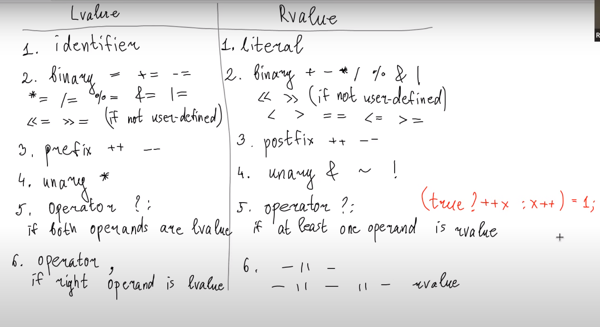
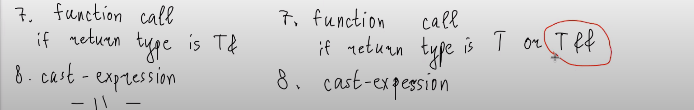
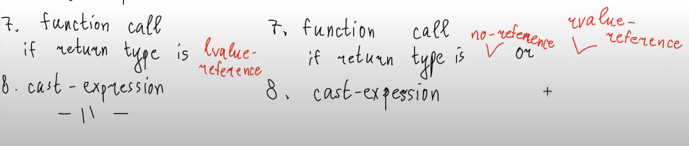
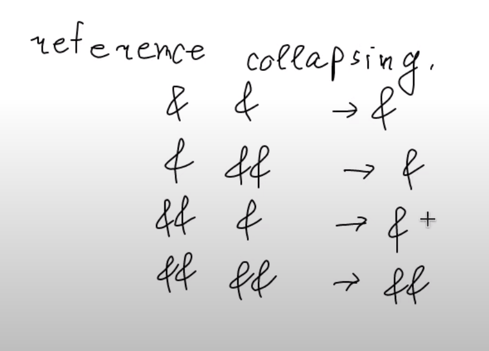

# Formal definition of lvalue & rvalue
***
> lvalue и rvalue - не типы переменных, а типы выражений  
> выражения - то, что заканчивается;
>
### Классификация выражений по rvalue и lvalue.

### Reference collapsing
> если хоть раз при передаче передали как lvalue reference, то в итоге получим lvalue ссылку
> 

> передаем как T&& чтобы именно попасть в версию метода для rvalue ссылки
> (мувающую версию)
