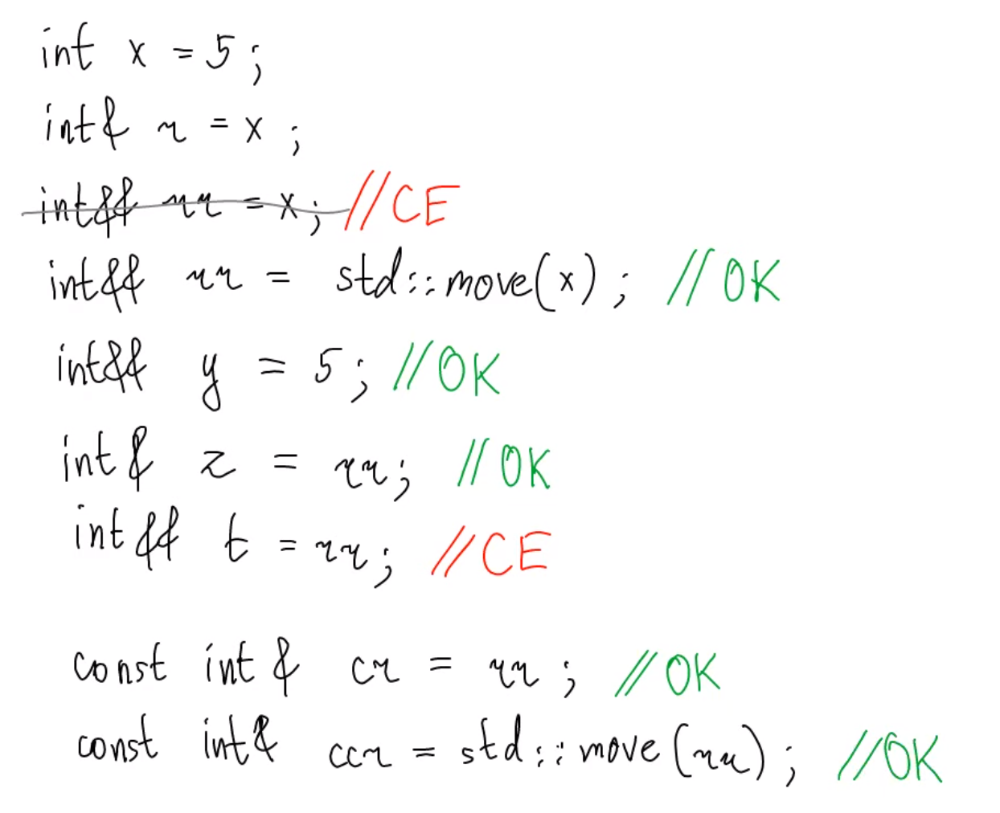

# Rvalue-references and their properties
***



### ссылочные квалификаторы

```c++
struct S {
    void f() & {
        std::cout << 1;
    }
    
    void f() && {
        std::cout << 2;
    }
    
    void f() const && {
        std::cout << 3;
    }
    
    void f() const & {
        std::cout << 4;
    }
};

int main() {
    S s;
    s.f();
    S().f();
    
}
```