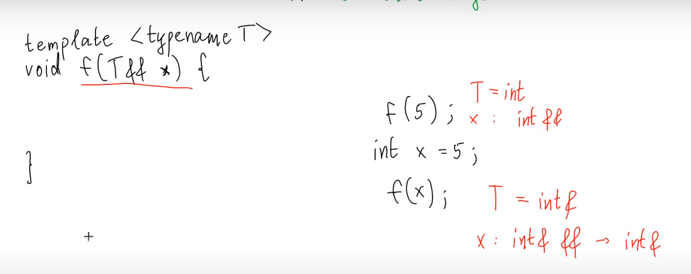

# Perfect forwarding problem.
***
```c++
template <typename... Args>
void emplace_back(Args&&... args) {
    if (sz >= cap) {
        reserve(cap * 2);
    }
    AllocTraits::construct(alloc, arr+sz, std::forward<Args>(args)...)
    +sz;
}
```

> Когда параметр является шаблонным аргументом ф-ии
> то все равботет иначе:


