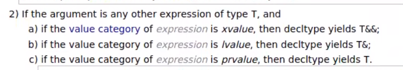

# decltype keyword
***
### decltype высчитывается в compile time
```c++

void g() {}

int main() {
    int a = 5;
    decltype(a) b = 6; // decltype(a) = int
    //decltype(++a) - nothing will count
    
    std::map<int, std::string> m;
    m[1] = "abc";
    m[3] = "aaaaa";
    
    for (auto x: m) {
        x.second = "aaa";
    }
    
    decltype(m[0]) b;
    
    const decltype(g)* // void*
    
    decltype(++a) b; // CE - ++a is int&
    decltype(++a) b = 5; // CE - ++a is int&
    decltype(++a) b = a; // OK
    
    decltype(a++) b; // OK
    
    decltype((a)) b; // (a) - is int& LoL
}
```


```c++
template <typename Container>
auto& getByIndex(Container& container, size_t index) {
    std::cout << "get By Index called\n";
    return container[index];
} // is not okay with vector<bool>

template <typename Container>
auto getByIndex(Container& container, size_t index)
    -> decltype(container[index]) {
    std::cout << "get By Index called\n";
    return container[index];
} // auto defines on type of container[index]

template <typename Container>
decltype(auto) getByIndex(Container& container, size_t index) {
    std::cout << "get By Index called\n";
    return container[index];
} // same as previous
```