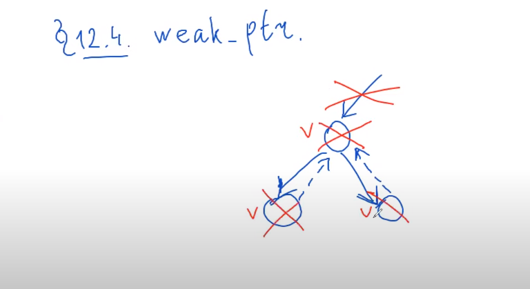

# weak_ptr.
***
> в каждом цикле должен быть weak_ptr, т.е. не должно быть циклов из non-weak_ptr



```c++
namespace my {
    
    
    template <typename T>
    class shared_ptr {
        template <typename T>
        friend shared_ptr<T> make_shared(Args... args);
    private:
        ControlBlock* cb;
        
        struct ControlBlock {
            T object;
            size_t shared_counter; 
        };
        
        shared_ptr(ControlBlock* pc);
    public:
        
        shared_ptr(T* ptr): ptr(ptr), count(new int(1)) {}
        
        shared_ptr(const shared_ptr& other)
            : ptr(other.ptr), count(other.count)
        {
            ++*count;
        }
        
        shared_ptr(shared_ptr&& other) noexcept
            : ptr(other.ptr), count(other.count)
        {
            other.ptr = nullptr;
            other.count = nullptr;
        }
        
        // TODO: operator=(&) operator=(&&)
        
        ~shared_ptr() { // TODO: what if we were created using make_shared...
            // we need to be deleted the other way..... AAAAAAAAAAAAAAAAA!!!!!!!!!!!!!!!!!!!!
            --*count;
            if (*count == 0) {
                delete count;
                delete ptr;
            }
        }
    };
    
}


template <typename T>
class weak_ptr {
    T* ptr;
    size_t* shared_count;
    size_t* weal_count;
    
    controlBlock {
        T t;
        size_t count;
    };
public:
    
    bool expired() const {
        return ???
    }
};
```