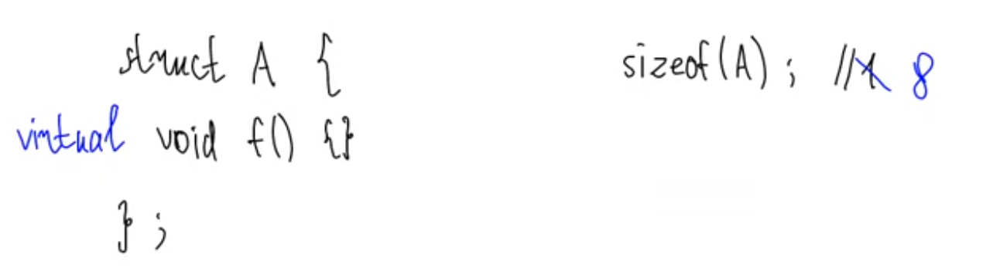
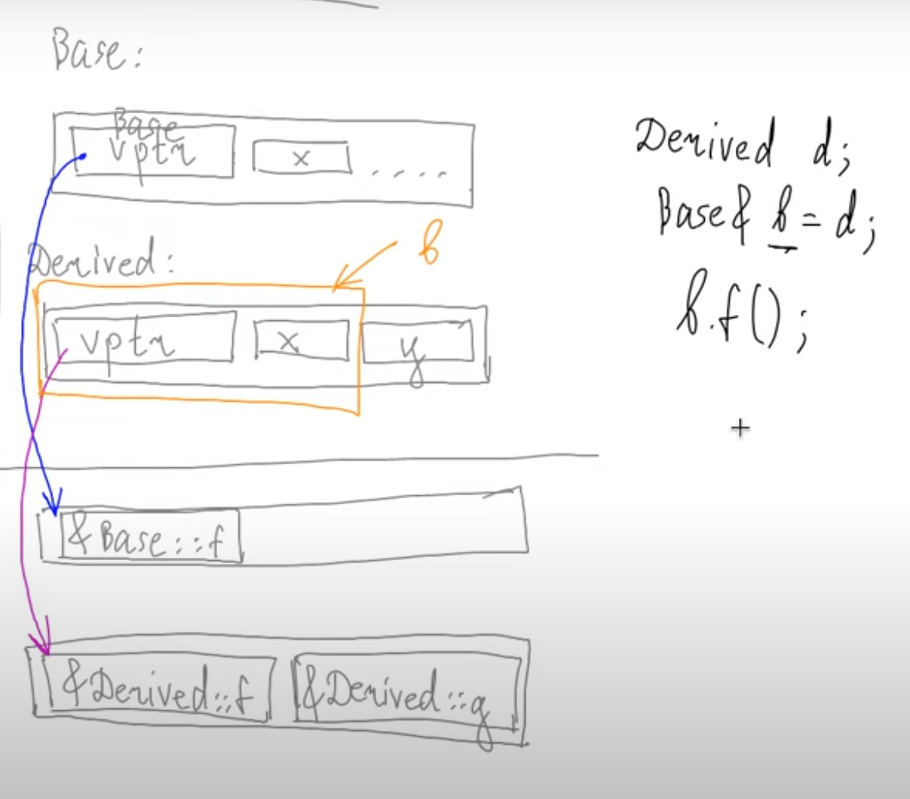
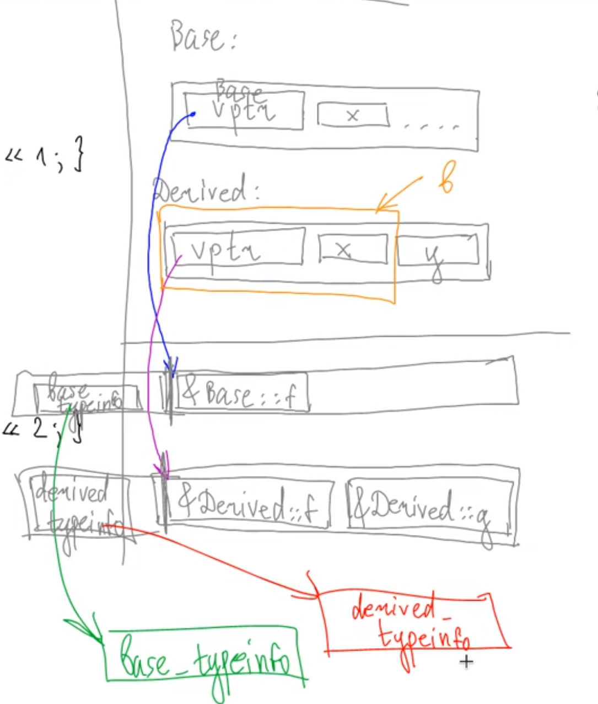

# Virtual tables, implementations of virtual functions.
***

```c++
struct Base {
    int x;
    virtual void f() {cout << 1;}
    void g() {}
};

struct Derived: Base {
    int y;
    void f() override {cout << 2;}
    virtual void g() {}
};

int main() {
    Derived d;
    Base& b = d;
    b.f();
}
```


> но это не все, что содержит таблица виртуальных ф-ий  
> еще она хранит typeinfo

