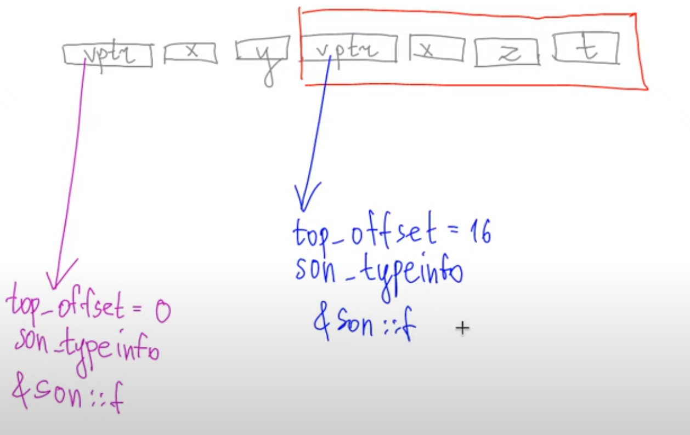
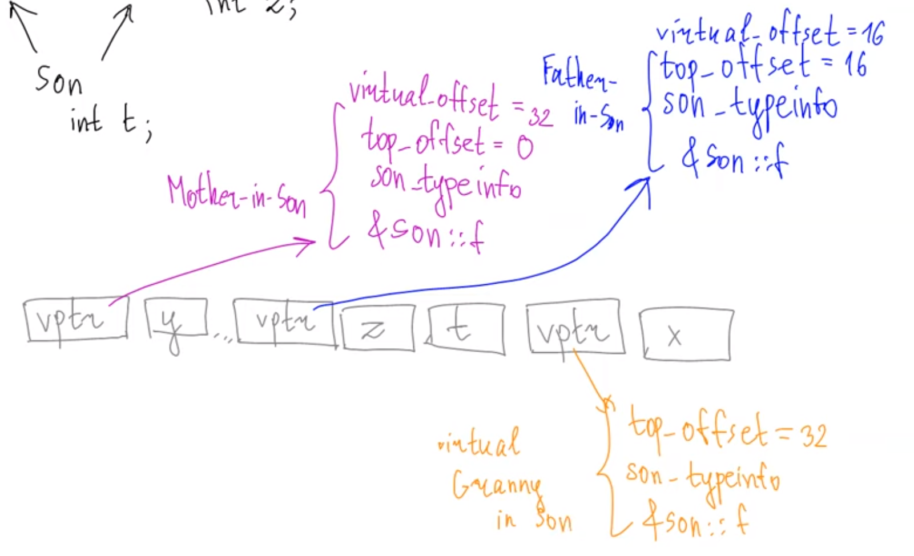

# Virtual tables with multiple inheritance.
***
```c++
struct Granny {
    int x;
    virtual void f();
};

struct Mother : Granny {
    int y;
};

struct Father : Granny {
    int z;
};

struct Son : Mother, Father {
    int t;
};
```
> [vptr1][x][y][vptr2][x][z][t]  
> в таблице vptr1 и vptr2 отличаются top_offset


```c++
struct Granny {
    int x;
    virtual void f();
};

struct Mother : virtual Granny {
    int y;
};

struct Father : virtual Granny {
    int z;
};

struct Son : Mother, Father {
    int t;
};
```

