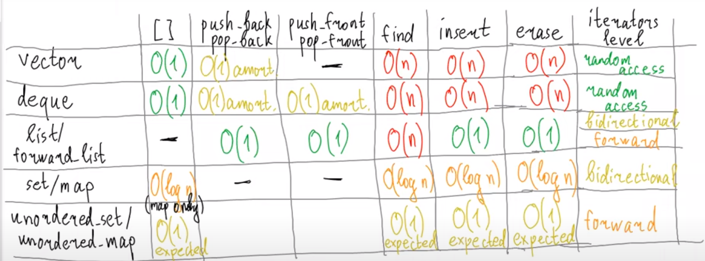

# Iterators Idea, basic usage
***

> 1. Input Iterator - один проход по последовательности (istream_iterator)
> 2. Forward Iterator ``++``
> 3. Bidirectional Iterator ``++ --``
> 4. RandomAccess Iterator ``+=n -=n < > >= <= it1-it2``  
> deque
> 5. Contiguous Iterator ``&(*it)+1``  
> vector, T*, array

```c++
using value_type = ...;
using iterator_category = ...;


template <typename Iter>
void process(Iter begin, Iter end) {
    --end; // end - указатель на элемент после последнего
    typename Iter::value_type tmp = *begin;
    if (std::is_same<typename Iter::iterator_category, std::random_access_iterator_tag>)
}
```

> ``std::iterator_traits<Iter>``
***
> Виды итераторов - это то, как мы помним информацию
> 
> Ответить, есть ли человек у меня в друзьях в вк - проще, чем перечислить всех
> 
> Уметь перечислять в одну сторону - проще, чем в две, например строчки стиха
> 
> Помнить элемент по позиции - сложнее чем уметь перечислять в обе стороны, 
> пример - станции метро по маршруту поездки
>