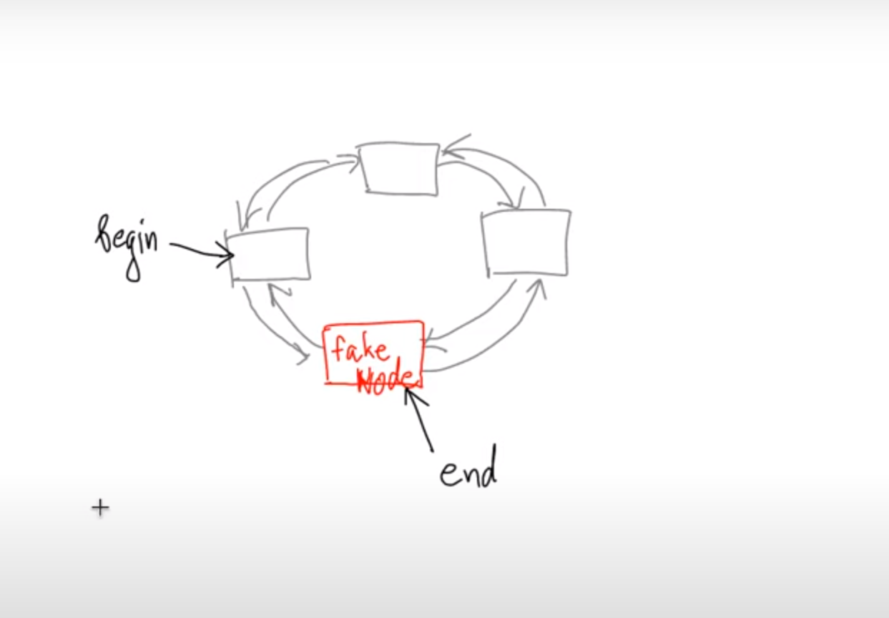

# list & forward_list
***

```c++
template <typename T>
class list {
private:
    struct baseNode{
        baseNode* prev;
        baseNode* next;
    };
    struct Node : baseNode {
        T value;
    };
};
```