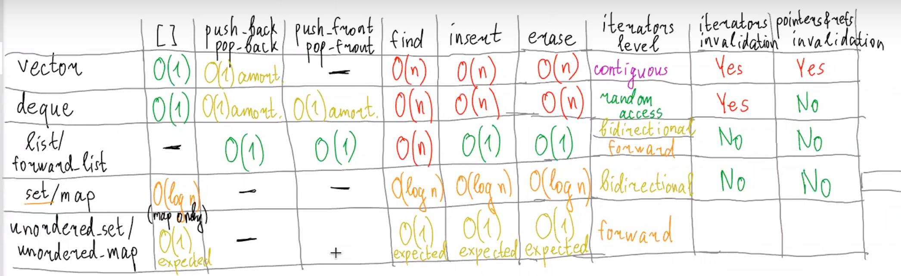

# set/map
***
> red black дерево поиска
```c++

template<typename First, typename Second>
struct pair {
    Firtst first;
    Second second;
};

template <typename T> 
struct less{
    bool operator()(const T& x, const T& y) const {
        return x < y;
    }
};

template <typename Key, typename Value,
        typename Compare = std::less<Key>>
class map{
private:
    using value_type = pair<const Key, Value>;
    
    struct baseNode {
        Node* left;
        Node* right;
        Node* parent;
        bool red;
    };
    
    struct Node : baseNode {
        value_type kv;
    };
    
    baseNode* leftmost;
    baseNode* root;
    Compare comp;
    /*
     *        fakeRoot <- end
     *           /
     *          /
     *         / 
     *       tree
     *       /
     *      / 
     *     /  
     *  leftmost    
     */
public: 
    
    struct iterator {
        BaseNode* node;
        
        value_type& operator*() const {
            return (static_cast<Node*>(node))->kv;
        }
    };
    
    
    Value& operator[](const Key& key);
};


int main() {
    
    std::map<std::string, int> m;
    m[0] = "abcc"; // less effective
    // const map has no operator [] 
    m.insert({0, "abc"});
    for(std::map<std::string, int>::iterator it = m.begin();
        it != m.end(); ++it)
    {
        
    }
}
```
