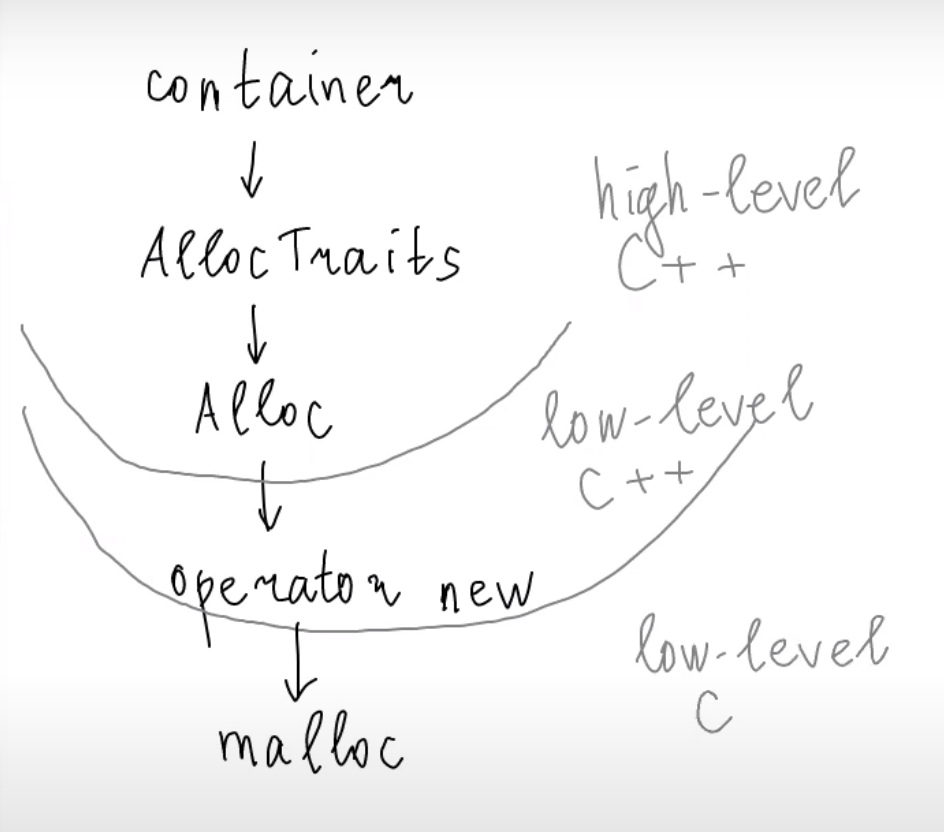
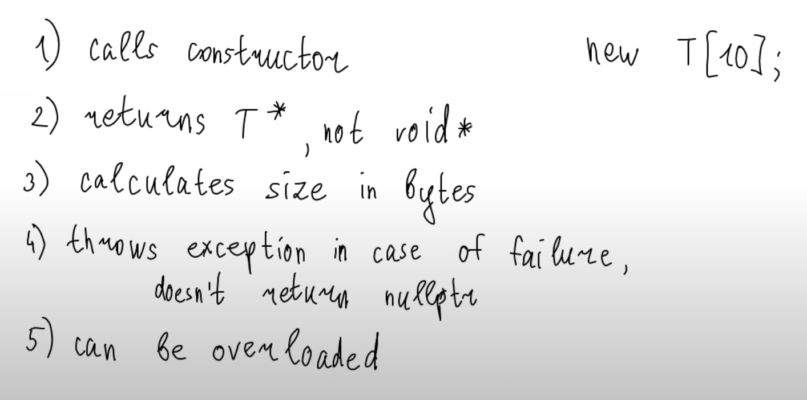

# перегрузка операторов new и delete
***

> Чем ``new`` круче ``malloc``



```c++

void* operator new(size_t n) {
    std::cout << "Allocating " << n << " bytes..." << '\n'; 
    void* ptr = std::malloc(n);
    if (!ptr) {
        throw std::bad_alloc("Boom!");
    }
    return ptr;
}

void operator delete(void* ptr) {
    std::cout << "Deallocating...\n";
    std::free(ptr);
}

void* operator new(size_t n, const std::nothrow_t&) {
    std::cout << "Allocating " << n << " bytes..." << '\n';
    void* ptr = std::malloc(n);
    if (!ptr) {
        throw std::bad_alloc("Boom!");
    }
    return ptr;
}

//void* operator new(size_t n, void* ptr) {
//    std::cout << "Placement new " << n << " bytes..." << '\n';
//    return ptr;
//} нельзя переопределять

struct S {
    void* operator new(size_t n) {
        std::cout << "Allocating..." << n << " bytes for S \n";
        void* ptr = std::malloc(n);
        if (!ptr) {
            throw std::bad_alloc("Badumts!");
        }
        return ptr;
    }
    
    void operator delete(void* ptr) {
        std::cout << "Deallocating S\n";
        std::free(ptr);
    }
};


int main() {
    std::vector<int> v(5);
    
    for (int i = 6; i < 10; ++i) 
        v.push_back(i);
}
```
