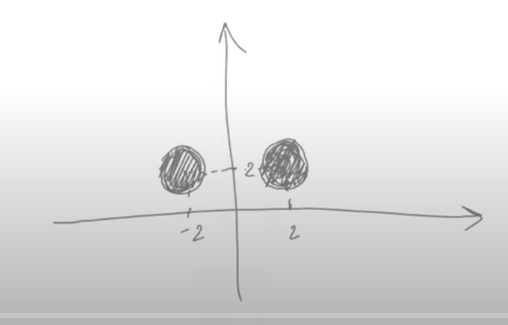

# Basic idea, examples.
***
> Вся суть доходчиво изложена [тут](https://vk.com/audio-2001231279_68231279)

> Полиморфизм:
> 1. Статический - шаблоны, перегрузки (разрешается на этапе комплияции)
> 2. Динамический - версия функции выбирается в run-time  

```c++
class Base{
    void f();
};

class Derived: Base {
    void f();
};

int main() {
    Derived d;
    Base& b = d;
    b.f(); // calls Base::f();
}
```

> Есть рекомендации как варить рис, овсянку, гречку
> Есть рекомендации как варить любую крупу 
> 
> И сказал Мещерин: "Сварите крупу" и указал на рис
> 
> Мы будем варить рис, как произвольную крупу или как рис?



> * Равны ли круги? Да. 
> * Равны ли множества точек? Нет.

> Виртуальная (``virtual``) ф-ия - такая ф-ия, что если ее вызвать у slice от наследника, то все равно вызовется версия для наследника